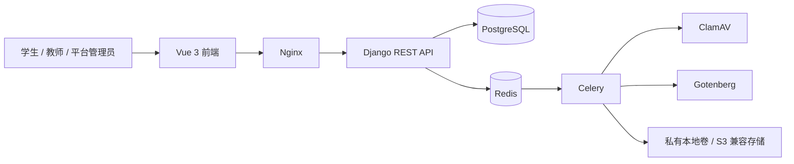

# 灵溯一校受控试点生产化设计

更新时间：2026-08-13  
状态：待产品确认后进入逐文件实施计划

## 1. 决策与范围

### 1.1 推荐决策

以“一校受控试点”为首个上线目标：服务 100–300 名师生，使用一个正式 HTTPS 域名，保留现有学校租户字段、平台端开校和学校授权能力，但不在试点阶段承诺大规模多校并发运营。

这样能先验证最重要的闭环：学生的真实研究过程能否被任务化沉淀，教师能否高效审核并推动下一步，平台能否安全地开通、停用和治理学校空间。

### 1.2 本轮必须交付

- 三端真实登录、角色路由和授权只读限制。
- 学生创建项目、教师认领、任务解锁、材料提交、教师打回/通过、报告导出闭环。
- 平台创建学校、邀请码、授权与配额管理、赛事和公告发布、公开案例治理。
- 私有附件上传、病毒扫描、授权下载、报告异步任务和失败反馈。
- 可按正式配置部署的 Docker Compose、备份恢复手册与预发布验收清单。

### 1.3 明确不在首个试点范围

- 自动查重、查新、视频理解和外部比赛报名系统对接。
- OCR、表格/文档正文解析和自动证据提取；首期允许上传原件与人工核对。
- 邮件、短信、企业微信通知；仅做站内公告与待办提示。
- 跨校排行榜、虚拟货币、付费道具或对学生的公开排名。
- 高可用、多地域容灾、商业计费与学校自助购买。

## 2. 当前基线：以代码和运行结果为准

### 2.1 已运行组件

当前 Docker 环境已启动并通过健康检查：Vue/Vite 前端、Django/Gunicorn、PostgreSQL、Redis、Celery、ClamAV、Gotenberg 和 Nginx。后端健康接口返回 `{"status":"ok"}`。

生产构建链路为：浏览器 → Nginx → `/api/` Django；Django 将异步工作投递到 Celery；Celery 使用 Redis，并调用 ClamAV 和 Gotenberg。私有媒体文件不由 Nginx 的 `/media/` 静态路径直接暴露，下载由 Django 鉴权接口返回。



### 2.2 已实现并有代码证据的业务能力

| 领域 | 当前状态 | 证据 |
| --- | --- | --- |
| 角色与租户 | 已实现 | `Account.role` 为 `student`、`teacher`、`platform_admin`；业务查询按学校或项目成员范围过滤。 |
| 自助注册/会话 | 已实现 | 邀请码注册、CSRF 会话登录、密码强度校验、按角色跳转。 |
| 学生项目 | 已实现 | 学生创建待认领项目；教师认领时从模板生成任务和材料快照。 |
| 游戏化任务 | 已实现基础版 | 任务有锁定、可开始、待审核、需修订、已通过/完成状态；通过审核后解锁下一项并记录 XP/连续天数。 |
| 材料审核 | 已实现 | 不可覆盖的版本记录、真实性确认、提交、打回必须填写意见、通过后解锁。 |
| 团队协作 | 已实现 | 负责人邀请 → 学生接受 → 主指导教师确认。 |
| 附件安全 | 已实现基础版 | 类型和大小限制、直接上传和可恢复分片上传、SHA-256、ClamAV 状态、鉴权下载。 |
| 报告导出 | 已实现基础版 | Celery 生成 DOCX，Gotenberg 转 PDF，仅装配最新已通过材料。 |
| 案例库 | 已实现基础版 | 负责人选择已通过材料申请公开，教师审核发布，平台可下架/恢复。 |
| AI | 已实现接入边界 | 后端 OpenAI 调用、请求记录、上下文范围、服务状态和学校月度配额提示。 |
| 平台运营 | 已实现基础版 | 学校空间、邀请码、授权期限、配额、赛事、公告与基础服务状态。 |

### 2.3 已核对的界面与路由

- `/login` 登录后，学生、教师和平台管理员分别进入 `/student/home`、`/teacher/home`、`/platform/home`。
- 平台管理员直接访问学生路径会回到平台首页；无匹配路径也不会进入项目过程页面。
- 学生首页强调唯一优先任务、当前完成度、待审核项和 AI 入口。
- 教师首页显示待审核材料、项目池、成员确认和指导项目数量。
- 平台首页仅显示学校授权与全局内容，不显示校内材料过程。

本轮浏览器审计截图与实际 DOM 状态已逐端核对；截图不单独作为功能通过证据，后续由 E2E 与接口测试补强。

### 2.4 本轮验证结果

- 前端：Vitest 25 个测试文件、50 个测试通过，生产构建通过。
- 后端：98 项业务、权限、上传、报告、案例与运行配置测试通过；`manage.py check` 通过。
- 运行环境：PostgreSQL、Redis、ClamAV、Django 均健康，Celery、Gotenberg、Nginx 与前端运行中；Redis、ClamAV、Gotenberg 的平台只读诊断均实测为 `healthy`。
- 当前集成配置执行 `manage.py check --deploy` 出现 4 项 HTTPS/Cookie/HSTS 警告。这是集成演示环境显式关闭 TLS 选项导致，不代表正式生产配置可直接放行。

## 3. 产品工作流与责任边界

### 学生端：把真实工作转换为可审核证据

```text
创建项目草稿
  → 等待教师认领
  → 获得任务地图
  → 完成一项任务并提交文本/附件
  → 等待审核
  → 通过后解锁下一项；打回后优先修订
  → 已通过材料进入报告装配和公开申请
```

学生首页只回答“现在最应该完成什么”；项目概览只回答“项目做到哪、谁参与、卡在哪里”；任务页只负责证据编辑与提交；材料档案只负责版本回溯；报告页只负责已通过材料的装配。

### 教师端：判断、反馈、推进

```text
查看本校项目池 → 认领项目 → 确认成员
  → 查看待审核材料及历史版本 → 通过或填写可执行意见打回
  → 处理案例公开申请
```

教师不进入学生材料编辑器，不管理学校授权；其项目详情页应能一次看见团队、阶段、风险、待审核材料和最近活动。

### 平台端：授权和全局治理

```text
创建学校空间 → 生成邀请码 → 设置授权与配额
  → 发布全局赛事/公告 → 下架或恢复公开案例
```

平台端不查看学校项目过程和私有附件；它仅维护学校可用性、基础用量与全局公开内容。

## 4. 架构判断与风险台账

### P0：试点前必须解决

| 风险 | 当前原因 | 处理方案 | 验收证据 |
| --- | --- | --- | --- |
| HTTPS 尚未完成 | 集成环境显式关闭 Secure Cookie、HTTPS 跳转和 HSTS | 提供生产环境变量模板、TLS 反向代理配置、部署前配置校验 | 正式域名上 `check --deploy` 无关键警告；Cookie 带 Secure；HTTP 自动跳 HTTPS。 |
| 核心链路缺少浏览器回归 | 当前仅有模型/接口测试，未覆盖真实点击、刷新与页面状态 | 增加三条最小 E2E：登录路由、学生提交—教师打回—重提—通过、学校授权只读 | 每次发布在干净数据库可重复通过。 |
| 写操作反馈不完整 | 部分组件仍只显示接口错误或各自维护提示 | 统一 OperationFeedback、禁用重复点击、失败保留输入、重试入口 | 人工走查和组件测试覆盖创建、提交、审核、启停、下架。 |
| 审计记录不完整 | 核心项目动作已留痕，但需持续随着新增写操作补齐 | 已覆盖认领、成员确认、材料与案例审核、学校授权、邀请码重置和报告导出请求；审计事件只保存对象 ID、操作结果与格式等非敏感摘要 | 平台可按学校查询操作人、时间、对象和非敏感摘要。 |
| 字符串布尔值造成错误状态转换 | 历史 action 使用 Python `bool()`，`"false"` 也会变为真 | 已修复：案例可见性、成员审批、真实性确认和学校授权更新均严格校验布尔输入 | 对应接口边界用例覆盖字符串与真实布尔值。 |
| 代码边界趋于失控 | `views.py` 883 行、全局样式 876 行，接近约定上限 | 按认证、项目、材料、治理拆分 API 视图；按布局、组件、门户拆分样式 | 单个源码文件控制在 600 行以内，功能不回归。 |

### P1：试点期间完成或受控启用

| 风险 | 当前原因 | 处理方案 |
| --- | --- | --- |
| AI 配额竞态 | 先计数后创建记录，并发请求可能超额 | 用数据库事务和学校级配额预留记录；任务完成/失败释放或结算。 |
| 服务状态不真实 | 平台页曾只判断配置是否存在，未探测 Celery/ClamAV/Gotenberg 可用性 | 已修复：后端以 2 秒超时探测 Redis、ClamAV、Gotenberg；仅返回健康状态词，不返回密钥、连接串或密码。 |
| 教师无法回溯学生 AI 采用记录 | AI 查询按 `actor=self.request.user` 限制 | 教师在自己指导项目内只读查看 AI 请求目的、上下文范围、输出和采用标记。 |
| 任务和材料状态易重复 | 部分页面依赖重复加载与条件分支 | 拆分学生项目概览、地图、材料和报告路由组件；统一领域状态转换。 |
| 报告表达力有限 | DOCX 只装配文字，不处理图片/表格/封面目录 | 试点仅明确支持文字报告；下一阶段增加可控图片、表格、封面和模板。 |

### P2：规模化前必须完成

| 风险 | 处理方案 |
| --- | --- |
| 文档/OCR 解析 | 异步解析器、人工校对标志、解析失败可重试；禁止把低置信度解析直接视为证据。 |
| 运维可观测性 | 结构化日志、错误追踪、任务失败告警、慢请求指标和磁盘空间告警。 |
| 备份恢复可信度 | 修正脚本的环境文件选择与安全清理；在隔离环境完成一次实际恢复演练。 |
| 隐私和数据保留 | 明确学生个人信息、附件、公开案例和日志的保留/删除规则与责任人。 |
| 多校容量 | 针对学校范围过滤、对象存储、任务并发、数据库索引和限流进行压测。 |

## 5. 技术选择

维持现有技术栈，不引入第二套后端或复杂微服务：

- 前端：Vue 3、TypeScript、Vue Router、Pinia、Element Plus、Vite。
- 后端：Django、DRF、PostgreSQL、Celery、Redis。
- 文件和任务：私有本地卷起步，使用现有 S3 兼容存储接口平滑迁移；ClamAV 与 Gotenberg 保持内网服务。
- 认证：继续采用 Django Session + CSRF；同源 Nginx 部署，不向浏览器分发密钥。
- 部署：Docker Compose 单机试点；生产以 Nginx/TLS 为统一入口。

选择原则是保持一个数据库、一个 API、一个异步队列。对于一校试点，这比引入微服务、消息总线或多套身份系统更可维护。

## 6. 四周交付计划与资源安排

### 资源

| 角色 | 建议投入 | 主要职责 |
| --- | ---: | --- |
| 全栈开发 | 1.0 人 | 后端工作流、前端模块拆分、部署配置、关键缺陷修复。 |
| 前端/UX | 0.5 人 | 三端一致性、反馈状态、无障碍与桌面端视觉回归。 |
| 产品/测试 | 0.5 人 | 试点场景、验收数据、UAT、权限与隐私检查。 |
| 学校试点负责人 | 按需 | 邀请码分发、教师/学生培训、真实项目验收。 |

### 里程碑

| 周期 | 目标 | 交付与验收 |
| --- | --- | --- |
| 第 1 周：可信闭环 | 消除假交互和不确定状态 | 统一写操作反馈、补核心审计事件、三条 E2E、修复路由和授权只读边界。 |
| 第 2 周：三端独立可用 | 降低重复与条件分支 | 拆分学生项目页、教师审核页、平台治理页；教师项目详情和学校配置稳定可用。 |
| 第 3 周：成果可追溯 | 把异步能力变成可理解的用户体验 | 上传/扫描/报告队列反馈和重试；AI 服务状态与配额一致；公开案例白名单专项验证。 |
| 第 4 周：预发布与试点 | 在正式部署环境验证 | HTTPS、备份恢复演练、UAT、上线手册、真实试点账号和回滚方案。 |

## 7. 验证策略：足够而不过度

测试优先覆盖不可由肉眼可靠判断的边界，不为静态文案堆重复测试。

1. 单元/接口：权限、状态转换、配额、报告白名单、上传安全和授权只读。
2. E2E：仅维护三条高价值路径——登录/路由、学生—教师审核回路、平台授权停用。
3. 发布前：一次 500MB 上传演练、一次导出失败重试、一次跨学校越权检查、一次隔离恢复演练。
4. 视觉走查：1280px 与 1440px，重点检查任务地图、教师审核桌和平台授权表，不把截图当作接口正确性证明。

## 8. 错误与解决方法记录

| 日期 | 现象 | 根因 | 已采取方法 | 防止复发 |
| --- | --- | --- | --- | --- |
| 2026-08-13 | 用户打开深链路时被强制跳回学生端 | 早期角色演示切换和路由守卫职责重叠 | 改为基于 `/api/me/` 的单一会话身份和角色门户路由 | E2E 覆盖刷新、前进后退和错误角色路径。 |
| 2026-08-13 | 任务地图章节内容错位 | 章节信息和任务内容使用不稳定的左右布局，窄宽度下高度不一致 | 改为章节头部与任务列表的垂直结构，并单独校验学生地图状态 | 视觉回归检查 1280/1440 宽度；布局规则不与状态代码混写。 |
| 2026-08-13 | 提交后仍显示不可用编辑表单 | 页面没有为待审核态建立单一只读状态 | 保留提交内容，仅展示“等待审核”与版本入口 | 状态模型为每个任务状态定义唯一主行动。 |
| 2026-08-13 | `check --deploy` 显示 TLS/Cookie 警告 | 集成环境为本地 HTTP 演示，显式关闭安全开关 | 不把集成配置当生产配置；生产配置默认启用安全开关 | 上线前在真实 HTTPS 域名执行部署检查并保存结果。 |
| 2026-08-13 | 尝试保存浏览器截图时本地路径不存在 | 浏览器截图 API 返回内存字节，不会自动创建目录/文件 | 用浏览器返回的实际截图字节进行审阅，不假设写入成功 | 对工具输出先核对文件是否存在；避免把工具行为当作文件证据。 |
| 2026-08-13 | 字符串 `"false"` 被当作真值，可能错误公开案例、通过成员或确认材料真实性 | HTTP action 直接使用 Python `bool()` 转换请求参数 | 关键状态 action 严格要求 JSON 布尔值，并为真实性确认保留清晰的 false 提示 | 所有安全/治理状态转换不得对字符串使用隐式布尔转换；以接口边界用例回归。 |

## 9. 上线门槛

在以下条件全部满足前，不对外宣称“生产级上线”：

- 生产域名、证书、`DJANGO_ALLOWED_HOSTS`、`CSRF_TRUSTED_ORIGINS` 和 Secure Cookie 完整配置。
- 三条核心 E2E 在干净数据库重复通过。
- 学生、教师和平台管理员的越权读取与写入专项测试通过。
- 附件扫描、报告导出、任务失败重试和授权只读状态均有可见反馈。
- 已完成一次备份和隔离恢复演练。
- 有明确的试点联系人、回滚步骤、问题响应时限和数据处理规则。

## 10. 下一步

本设计确认后，进入逐文件实施计划。顺序固定为：

1. 生产安全与核心 E2E；
2. 审计事件和三端页面/状态边界拆分；
3. 异步任务反馈、AI 配额一致性和服务诊断；
4. 预发布运维、备份恢复与 UAT。
